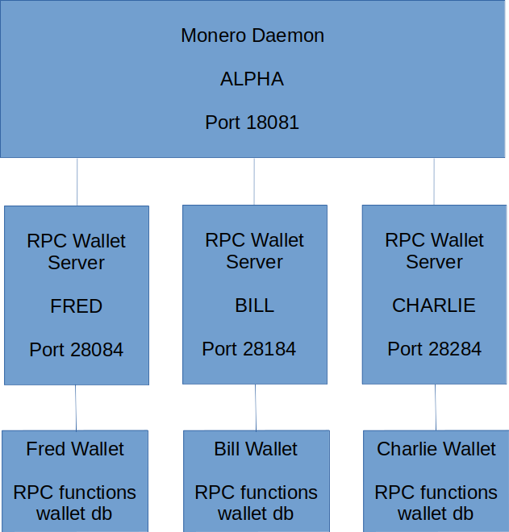

# Monero Development Harness

Monero development Harness - documentation and notes

## Architecture

Embedded in Tmux

## Using

### Prerequisites

- **monero-x86_64-linux-gnu-v0.18.3.3** or later <https://downloads.getmonero.org/cli/linux64>
- **linux** (tested on Ubuntu 22.04)
- **jq** (1.6)

### Run

run `./harness.sh`

## Useful Links

<https://web.getmonero.org/resources/moneropedia>

Monero wallets are accounts based

<https://web.getmonero.org/resources/moneropedia/account.html>
