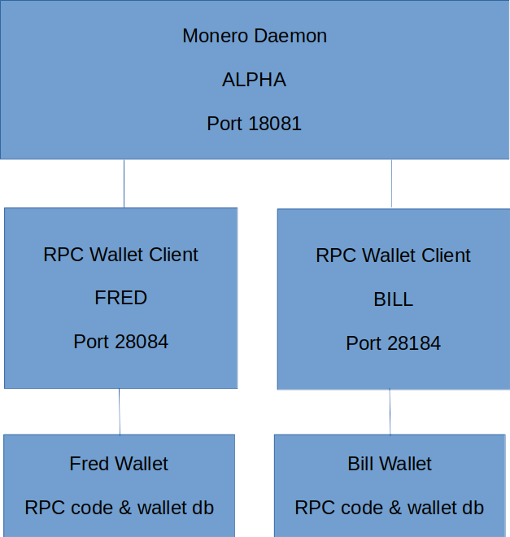

# Monero Development Harness

Monero development Harness - documentation and notes

## Architecture

Embedded in Tmux

## Using

### Prerequisites

- linux (tested on Ubuntu 22.04)
- jq (1.6)

### Run

Run harness.sh

TODO:

## Useful Links

<https://web.getmonero.org/resources/moneropedia>

Monero wallets are accounts based

<https://web.getmonero.org/resources/moneropedia/account.html>
